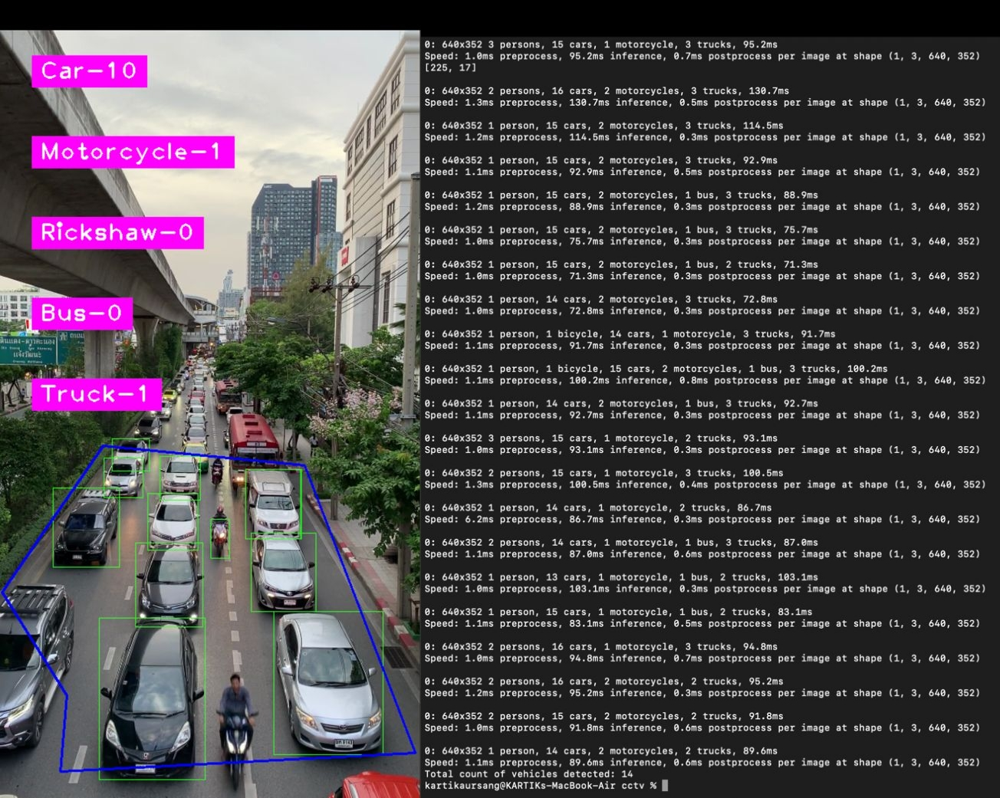

------------------------------------------

### Team Name

TECH CHALLENGERS

------------------------------------------
### Team Members:
KARTIK AURSANG(LEADER),
SOURABH SHENDGE,
NANDKISHORE YELE.
------------------------------------------

### Problem Statement:
Traffic Flow Optimization and Congestion Management

------------------------------------------
<h1 align="center">Adaptive Traffic Signal Timer</h1>

<h4>This Intelligent Traffic Signal Timer leverages real-time camera feeds from intersections to assess traffic density through YOLO object detection. Based on this analysis, it dynamically adjusts the signal timings. This approach aims to alleviate traffic congestion, enhance commuting speed, and minimize fuel consumption for a more efficient traffic flow.</h4>

-----------------------------------------
### Motivation

With the urban population and the number of vehicles on the rise, traffic congestion has emerged as a pressing challenge in modern cities. These traffic snarls not only lead to delays and frustration for motorists but also contribute to increased fuel consumption and environmental pollution.

Data from the TomTom Traffic Index reveals that three Indian cities—Mumbai, Bengaluru, and New Delhi—are among the top 10 globally affected by traffic congestion. Residents often find themselves spending valuable hours stuck in traffic, diminishing the quality of their daily commute. Traditional traffic light systems rely on fixed timers, lacking the flexibility to adapt to real-time traffic conditions.

To address this issue and alleviate traffic congestion, we have designed an enhanced traffic management solution: a Computer Vision-based adaptive traffic light controller. This innovative system dynamically adjusts the duration of green lights based on the traffic volume at each signal. It prioritizes longer green signal times for directions with higher traffic density, ensuring a more efficient flow of vehicles through the intersection.

------------------------------------------
### Implementation 

Vehicle Recognition Module - This component is designed to identify and count vehicles within images captured by the camera. It will categorize the vehicles into different classes, such as cars, motorcycles, buses, trucks, and auto-rickshaws, and provide a count for each class.

Traffic Light Control Algorithm - This algorithm dynamically adjusts the timing of red, green, and yellow lights at the traffic signals. The timings are determined based on the vehicle counts from the Vehicle Recognition Module, as well as factors like the number of lanes, average speeds of different vehicle classes, and other traffic conditions.

Traffic Simulation Module - Developed using the Pygame library, this module creates a realistic simulation of traffic signals and vehicles navigating through an intersection. It visually represents the traffic flow, signal changes, and vehicle movements to provide an interactive view of the traffic scenario.

------------------------------------------
### Demo

* `Vehicle Detection`

 

  

* `Signal Switching Algorithm and Simulation`

    

------------------------------------------

